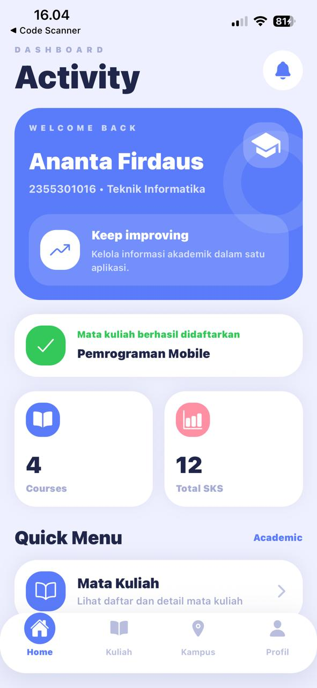
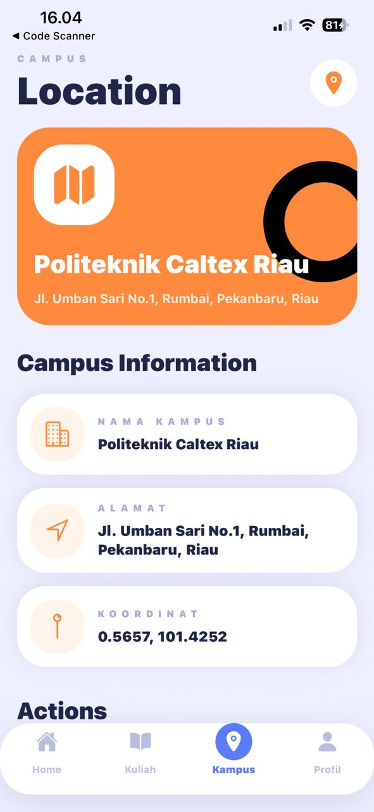
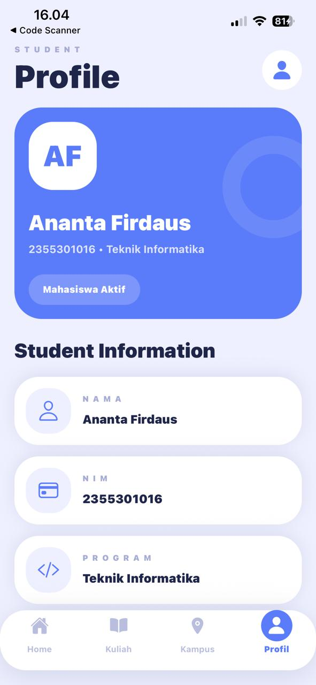

# EduGuide - Panduan Akademik Mahasiswa

<p align="center">
  
</p>

EduGuide adalah aplikasi mobile sederhana berbasis **React Native** yang dirancang untuk membantu mahasiswa mengakses informasi akademik secara mudah dan cepat. Aplikasi ini menyediakan fitur daftar mata kuliah, detail mata kuliah, profil mahasiswa, lokasi kampus, serta aksi intent seperti membuka Google Maps, mengirim email, menghubungi dosen, dan membagikan informasi mata kuliah.

Aplikasi ini dikembangkan sebagai tugas mobile programming dengan penerapan navigasi antar screen, passing data, bottom navigation, daftar data menggunakan FlatList sebagai padanan RecyclerView pada React Native, serta penggunaan explicit dan implicit intent.

---

## Informasi Mahasiswa

| Keterangan    | Data                   |
| ------------- | ---------------------- |
| Nama          | Ananta firdaus         |
| NPM           | 2355301016              |
| Program Studi | Teknik Informatika     |
| Kampus        | Politeknik Caltex Riau |

---

## Nama Aplikasi

**EduGuide**

### Subtitle

**Panduan Akademik Mahasiswa**

---

## Fitur Aplikasi

### 1. Splash Screen

Aplikasi menampilkan halaman splash screen sebelum masuk ke halaman utama.

### 2. Home Screen

Halaman utama menampilkan informasi selamat datang, ringkasan akademik, menu cepat, dan daftar singkat mata kuliah.

### 3. Daftar Mata Kuliah

Halaman daftar mata kuliah menampilkan data mata kuliah menggunakan `FlatList`. Setiap data ditampilkan dalam bentuk card modern yang berisi kode mata kuliah, nama mata kuliah, dosen pengampu, jumlah SKS, ruangan, dan tombol untuk melihat detail.

### 4. Detail Mata Kuliah

Halaman detail menampilkan informasi lengkap mata kuliah. Pengguna dapat melakukan beberapa aksi seperti:

* Menghubungi dosen
* Membuka WhatsApp
* Membuka lokasi kampus di Google Maps
* Membagikan informasi mata kuliah
* Mengirim email
* Mendaftarkan mata kuliah dan kembali ke Home

### 5. Profil Mahasiswa

Halaman profil menampilkan informasi mahasiswa seperti nama, NPM, program studi, kampus, dan email.

### 6. Lokasi Kampus

Halaman lokasi kampus menampilkan informasi nama kampus, alamat, koordinat, serta tombol untuk membuka Google Maps dan mengirim email akademik.

---

## Teknologi yang Digunakan

* React Native
* Expo
* React Navigation
* NativeWind / Tailwind CSS
* React Native Paper
* Expo Linear Gradient
* Expo Vector Icons
* Expo Linking
* FlatList
* Material Design Style

---

## Struktur Folder

```txt
RDN/
├── App.js
├── babel.config.js
├── metro.config.js
├── tailwind.config.js
├── global.css
├── assets/
│   └── image/
│       ├── home.jpeg
│       ├── course.jpeg
│       ├── location.jpeg
│       └── profile.jpeg
└── src/
    ├── data/
    │   └── courses.js
    ├── navigation/
    │   └── AppNavigator.js
    └── screens/
        ├── SplashScreen.js
        ├── HomeScreen.js
        ├── CourseListScreen.js
        ├── CourseDetailScreen.js
        ├── ProfileScreen.js
        └── CampusScreen.js
```

---

## Instalasi Project

Clone atau buka folder project, lalu jalankan perintah berikut:

```bash
npm install
```

Install dependency tambahan:

```bash
npx expo install expo-linear-gradient @expo/vector-icons react-native-safe-area-context react-native-reanimated
npm install nativewind react-native-paper
npm install @react-navigation/native @react-navigation/native-stack @react-navigation/bottom-tabs
```

Jalankan aplikasi:

```bash
npx expo start --tunnel -c
```

---

## Dokumentasi Tampilan Aplikasi

### Home Screen

Halaman Home menampilkan dashboard utama mahasiswa, informasi akademik singkat, menu cepat, serta daftar mata kuliah terbaru.

<p align="center">
  
</p>

---

### Course Screen

Halaman Course menampilkan daftar mata kuliah yang tersedia dalam bentuk card.

<p align="center">
  
</p>

---

### Campus Location Screen

Halaman Campus menampilkan informasi kampus, alamat, koordinat, dan aksi untuk membuka Google Maps atau mengirim email.

<p align="center">
  
</p>

---

### Profile Screen

Halaman Profile menampilkan informasi identitas mahasiswa.

<p align="center">
  
</p>
## Implementasi Navigasi

Aplikasi menggunakan **React Navigation** untuk mengatur perpindahan antar halaman.

Jenis navigasi yang digunakan:

* Stack Navigation
* Bottom Tab Navigation

Contoh alur navigasi:

```txt
Splash Screen → Main Screen
Home → Detail Mata Kuliah
Course List → Detail Mata Kuliah
Detail Mata Kuliah → Home
```

---

## Implementasi Passing Data

Aplikasi menerapkan passing data antar screen, seperti:

* Nama mahasiswa
* NPM
* Data mata kuliah yang dipilih

Contoh data mata kuliah dikirim dari halaman Course List ke halaman Detail menggunakan parameter navigasi.

---

## Implementasi Intent

Aplikasi menggunakan `Linking` dan `Share` untuk menjalankan implicit intent.

Fitur intent yang digunakan:

| Fitur       | Fungsi                           |
| ----------- | -------------------------------- |
| Telepon     | Membuka aplikasi telepon         |
| WhatsApp    | Membuka chat WhatsApp            |
| Google Maps | Membuka lokasi kampus            |
| Share       | Membagikan informasi mata kuliah |
| Email       | Membuka aplikasi email client    |

---

## Kesesuaian dengan Fitur Wajib

| Fitur Wajib                  | Status    |
| ---------------------------- | --------- |
| Splash Screen                | Terpenuhi |
| Bottom Navigation            | Terpenuhi |
| Daftar Mata Kuliah           | Terpenuhi |
| RecyclerView / FlatList      | Terpenuhi |
| CardView / Card Layout       | Terpenuhi |
| Detail Mata Kuliah           | Terpenuhi |
| Passing Data                 | Terpenuhi |
| Explicit Intent / Navigation | Terpenuhi |
| Implicit Intent              | Terpenuhi |
| Material Design Style        | Terpenuhi |
| Dokumentasi Screenshot       | Terpenuhi |

---

## Kesimpulan

EduGuide merupakan aplikasi mobile berbasis React Native yang membantu mahasiswa mengakses informasi akademik secara praktis. Aplikasi ini menerapkan navigasi modern, passing data antar screen, tampilan card, daftar mata kuliah, serta penggunaan intent untuk membuka aplikasi eksternal seperti telepon, WhatsApp, Google Maps, email, dan fitur share.

Aplikasi ini diharapkan dapat menjadi contoh penerapan konsep navigasi dan intent pada pengembangan aplikasi mobile berbasis React Native.
